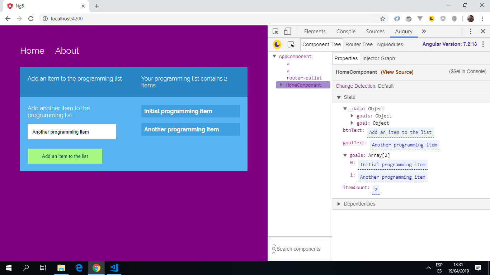

# :zap: Angular Animated List

* App using services, routing, interpolation, property & event-binding and Formbuilding to add text items to a list.
* **Note:** to open web links in a new window use: _ctrl+click on link_


## :page_facing_up: Table of contents

* [:zap: Angular Animated List](#zap-angular-animated-list)
  * [:page\_facing\_up: Table of contents](#page_facing_up-table-of-contents)
  * [:books: General info](#books-general-info)
  * [:camera: Screenshots](#camera-screenshots)
  * [:signal\_strength: Technologies](#signal_strength-technologies)
  * [:floppy\_disk: Setup](#floppy_disk-setup)
  * [:computer: Code Examples](#computer-code-examples)
  * [:cool: Features](#cool-features)
  * [:clipboard: Status \& To-Do List](#clipboard-status--to-do-list)
  * [:clap: Inspiration](#clap-inspiration)
  * [:file\_folder: License](#file_folder-license)
  * [:envelope: Contact](#envelope-contact)

## :books: General info

* Routing module allows user to navigate between Home and About pages.
* Item is added to an existing list of Programming Items.
* Angular FormBuilder used to create a simple form.
* RxJS BehaviourSubject used: A Subject that requires an initial value and emits its current value to new subscribers
* Angular Forms Module: Implements a set of directives and providers to communicate with native DOM elements when building forms to capture user input.

## :camera: Screenshots

.

## :signal_strength: Technologies

* [Angular v15](https://angular.io/)
* [RxJS Library v7](https://angular.io/guide/rx-library) used to [subscribe](http://reactivex.io/documentation/operators/subscribe.html) to input data [observable](http://reactivex.io/documentation/observable.html).
* [Angular Forms Module v15](https://angular.io/api/forms) used for form entry.

## :floppy_disk: Setup

* Run `ng serve` for a dev server. Navigate to `http://localhost:4200/`. The app will automatically reload if you change any of the source files.
* Run `npm run build` to create an optimzed build file.
* Run `npm run build:github` to create an optimised build file and deploy to your Github repo.

## :computer: Code Examples

* Home.Component class from `home.component.ts`

```typescript
export class HomeComponent implements OnInit {

  itemCount: number;
  btnText: string = 'Add an item to the list';
  goalText: string = 'Another programming item';
  goals = [];

  constructor(private _data: DataService) { }

  ngOnInit(): void {
    this._data.goal.subscribe(res => this.goals = res);
    this.itemCount = this.goals.length;
    this._data.changeGoal(this.goals);
  }

  addItem(): void {
    this.goals.push(this.goalText);
    this.goalText = '';
    this.itemCount = this.goals.length;
    this._data.changeGoal(this.goals);
  }

  removeItem(i: number): void {
    this.goals.splice(i, 1);
    this._data.changeGoal(this.goals);
  }
}
```

## :cool: Features

* Angular animations library used to make data entry more interesting.

## :clipboard: Status & To-Do List

* Status: Working.
* To-Do: Nothing

## :clap: Inspiration

* [Gary Simon of DesignCourse Tutorial: Learn Angular 5 in less than 60 Minutes - Free Beginner's Course](https://www.youtube.com/watch?v=oa9cnWTpqP8&t=50s)

## :file_folder: License

* This project is licensed under the terms of the MIT license.

## :envelope: Contact

* Repo created by [ABateman](https://github.com/AndrewJBateman), email: gomezbateman@gmail.com
